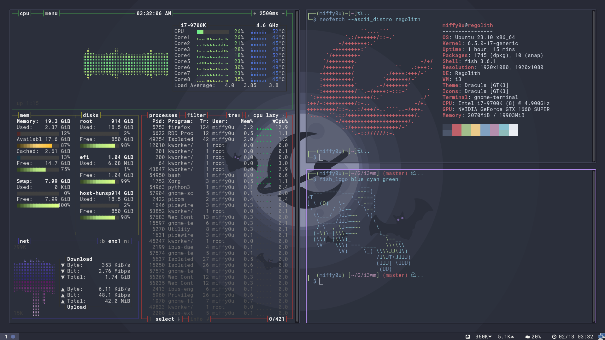

# **Note**
Regolith linux setup and rev/pwn environment construction



## Install Regolith
Install regolith on Ubuntu 23.10 from [here](https://regolith-desktop.com/docs/using-regolith/install/)

example:
```
wget -qO - https://regolith-desktop.org/regolith.key | \
gpg --dearmor | sudo tee /usr/share/keyrings/regolith-archive-keyring.gpg > /dev/null

echo deb "[arch=amd64 signed-by=/usr/share/keyrings/regolith-archive-keyring.gpg] \
https://regolith-desktop.org/release-3_1-ubuntu-mantic-amd64 mantic main" | \
sudo tee /etc/apt/sources.list.d/regolith.list

sudo apt update
sudo apt install regolith-desktop regolith-session-flashback regolith-look-dracula
```

## .config/regolith3/Xresources
```
wm.gaps.inner.size: 20
wm.gaps.outer.size: 10
wm.gaps.smart: false
```

## nord theme on gnome-terminal
```
git clone https://github.com/nordtheme/gnome-terminal.git
./gnome-terminal/src/nord.sh
```

## neofetch
```
sudo apt install neofetch
neofetch --ascii_distro regolith
```
## bashtop
```
sudo apt install bashtop
```

## fish\_logo
https://github.com/laughedelic/fish_logo
```
fish_logo blue cyan green
```

# **Utils**
## Enable japanese input 
Use ibus-mozc as Japanese input environment

```
sudo apt install ibus-mozc mozc-utils-gui
```

Mozc-Setup and Edit custom keymap: *Zenkaku/Hankaku => ctl + space*

## nvidia driver
```
sudo ubuntu-drivers devices
sudo apt install nvidia-driver-xxx(recommended)
reboot
```
## gnome screenshot
```
sudo apt install gnome-screenshot
```
